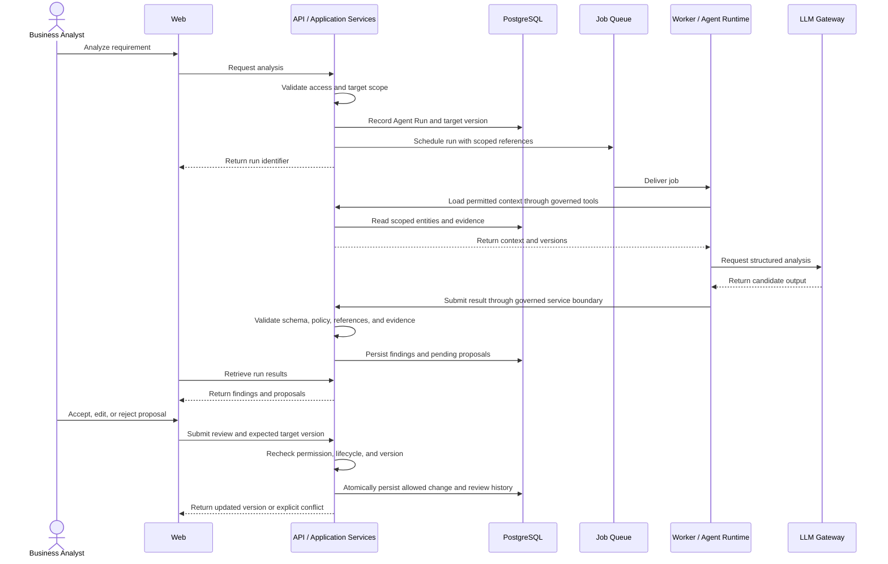

# BA Agent Platform — System Architecture

## 1. Architecture Goal

The system should be easy to develop as an MVP while preserving clear boundaries for future scale.

The target architecture is:

Modular Monolith
+
Background Worker
+
AI Agent Runtime

Do not introduce microservices during the MVP unless explicitly approved.

---

## 2. High-Level Architecture (Target)

User
→ Next.js Web
→ NestJS API
→ Domain / Application Services
→ PostgreSQL

Long-running processing:

NestJS API
→ Queue
→ Worker
→ Agent Runtime / Ingestion / Background Jobs

AI flow:

UI Action
→ API
→ Agent Runtime
→ Context Builder
→ LLM Gateway
→ Tool Executor
→ Structured Output
→ Validation
→ Human Review
→ Domain Commit

---

## 3. Current Repository

apps/
  web/
  api/
  worker/

packages/
  contracts/
  ui/
  config/
  utils/

docs/
  product/
  architecture/
  decisions/

---

## 4. Web Application

Technology:

- Next.js
- React
- TypeScript

Responsibilities:

- presentation
- navigation
- forms
- user interaction
- contextual AI actions
- visualization of findings
- visualization of proposals
- visualization of traceability

The web application must not become the authoritative business-rule layer.

---

## 5. API Application

Technology:

- NestJS
- TypeScript
- ESM
- Vitest

Responsibilities:

- REST APIs
- authorization
- domain rules
- requirement lifecycle
- validation
- persistence orchestration
- AI Agent run creation
- human approval operations

Controllers should remain thin.

Preferred direction:

Controller
→ Application Service
→ Domain Policy
→ Repository

---

## 6. Worker

Technology:

- TypeScript
- NodeNext

Future responsibilities:

- source parsing
- embeddings
- agent runs
- meeting analysis
- document generation
- queue consumers
- notification jobs

Long-running AI tasks should not block HTTP requests.

---

## 7. Database

Planned:

PostgreSQL

ORM:

Prisma

PostgreSQL is the primary system of record.

Use relational modeling for core entities.

Use JSONB selectively for flexible structures.

---

## 8. Vector Search

Planned:

pgvector

Use cases:

- source semantic search
- relevant context retrieval
- related requirement discovery

Vector similarity must not be treated as authoritative evidence.

---

## 9. Cache and Queue

Planned:

Redis

BullMQ

Redis may support:

- queues
- short-lived cache
- rate limiting
- temporary workflow state

Redis must not become the authoritative project knowledge store.

---

## 10. Object Storage

Planned:

S3-compatible object storage

Possible implementations:

- AWS S3
- Cloudflare R2
- MinIO

Store large files outside PostgreSQL.

Database should store metadata and storage references.

---

## 11. API Style

REST is the primary MVP API style.

Base direction:

/api/v1

Examples:

/api/v1/projects
/api/v1/requirements
/api/v1/meetings
/api/v1/agent-runs

Do not introduce GraphQL without a clear product need.

---

## 12. Realtime

Use Server-Sent Events where useful for:

- AI Agent progress
- document ingestion progress
- long-running analysis

WebSocket is not required for the initial MVP.

---

## 13. Agent Runtime

The Agent Runtime should contain:

- Agent Registry
- Orchestrator
- Context Builder
- Tool Registry
- LLM Gateway
- Output Validator
- Agent Run Service

Agents should not directly access the database.

---

## 14. Agent Tool Flow

Correct:

Agent
→ Tool
→ Domain/Application Service
→ Repository
→ Database

Incorrect:

Agent
→ Repository

or:

Agent
→ Database

---

## 15. Context Engine

The Context Engine should retrieve task-relevant information.

Potential context:

- current project
- target requirement
- source evidence
- related requirements
- business rules
- decisions
- open questions
- dependencies
- recent changes
- project glossary

Do not send the complete project database to the model.

---

## 16. LLM Gateway

LLM access should be centralized.

Responsibilities:

- provider adapter
- model selection
- structured output
- retry
- token usage
- logging
- cost measurement
- error normalization

Agents should not call provider SDKs directly.

---

## 17. Provider Independence

The architecture should allow model providers to change.

Possible future adapters:

- OpenAI
- Anthropic
- Google
- local model

Domain code must not depend directly on a provider-specific response type.

---

## 18. Shared Contracts

packages/contracts should contain shared domain contracts.

Examples:

- enums
- DTOs
- API contracts
- Zod schemas
- finding types
- requirement statuses

Avoid duplicating domain enums in multiple applications.

---

## 19. Security Boundary

Important requests must be scoped by:

- user
- workspace
- project

Future multi-tenancy requires strict tenant boundaries.

Agent tools must receive scoped context.

---

## 20. Background Job Direction

Potential job queues:

- source-ingestion
- embedding
- agent-run
- document-generation
- notification

Do not create a single giant worker function handling every job type.

---

## 21. Domain Events

The architecture may use domain events such as:

RequirementCreated
RequirementUpdated
RequirementApproved
RequirementBaselined
MeetingCompleted
QuestionAnswered
DecisionApproved
SourceIndexed

Initial implementation may remain simple.

---

## 22. Event Delivery

Future direction:

PostgreSQL Outbox
→ Worker / Queue

Kafka is not required for the MVP.

---

## 23. Search

Search may combine:

- SQL filtering
- full-text search
- keyword search
- vector search
- trace relationships

Search architecture should remain inside a Knowledge/Search service boundary.

---

## 24. Observability

The system should eventually record:

- request id
- correlation id
- user id
- workspace id
- project id
- Agent Run id
- model profile
- prompt version
- latency
- tool usage
- token usage
- errors

Do not log secrets.

---

## 25. Deployment Direction

MVP deployment units:

Web
API
Worker

Managed infrastructure may provide:

PostgreSQL
Redis
Object Storage

Kubernetes is explicitly unnecessary for MVP.

---

## 26. Architecture Upgrade Path

Possible later upgrades:

BullMQ
→ Temporal

PostgreSQL Search
→ OpenSearch

PostgreSQL Trace Links
→ Graph Database

Modular Monolith
→ selected microservices

These are upgrade paths, not current requirements.

---

## 27. Current Local Development

Configured local development defaults (not a live service-health check):

Web:
localhost:3000

API:
localhost:3001

Worker:
background process

Workspace:
pnpm

Local runner:
concurrently

Command:

pnpm dev

The root development script uses concurrently to start Web, API, and Worker.

---

## 28. Architecture Rule

Prefer the simplest architecture that preserves:

- domain boundaries
- traceability
- human governance
- testability
- future evolution

Do not add infrastructure because it is fashionable.

---

## 29. Implementation Status

Repository inspection on 2026-09-12 distinguishes the existing scaffold from the target design above.

| Component | Observed implementation | Planned capability |
| --- | --- | --- |
| Web | Next.js, React, and TypeScript application scaffold | BA workspaces and contextual AI review |
| API | NestJS ESM API with Workspace, Project, Requirement, Source/Evidence, Clarification Question, and governed Business Rule modules | Remaining governed domain modules, production authentication, and Agent Run APIs |
| Worker | TypeScript entry point that logs startup | Queue consumers, ingestion, and governed Agent execution |
| Shared packages | contracts package with strict request schemas and DTOs; ui/config/utils remain empty | Shared schemas, DTOs, configuration, and reusable components |
| Persistence | PostgreSQL/Prisma persistence with version history and project-scoped links for requirements, evidence, and questions; Worker has no database integration | Incremental pgvector support and remaining governed entities |
| Background infrastructure | No queue consumer in the Worker entry point | Redis and BullMQ |
| AI infrastructure | No Agent Runtime in the inspected source | Scoped tools, Context Builder, LLM Gateway, and output validation |

The API listens on PORT, defaulting to 3001, and uses the /api/v1 prefix. GET /api/v1/health reports API process liveness only; it does not verify database, queue, storage, or model-provider readiness. Workspace/Project routes and development-only bearer authentication are implemented. Other domain endpoints, production authentication, SSE, object storage, and full observability remain planned.

Source references: apps/api/src/main.ts, apps/api/src/app.module.ts, apps/worker/src/index.ts, and the root/application package.json files. Update this status when those implementations change.

## 30. Component Ownership and Module Boundaries

| Location | Responsibility | Boundary |
| --- | --- | --- |
| apps/web | Presentation, forms, navigation, and review interactions | No database access or authoritative approval rules |
| apps/api | REST entry points, application services, domain policies, and repositories | Controllers delegate; modules expose services rather than repositories |
| apps/worker | Long-running job execution and Agent orchestration | Agent tools use governed application services; no direct Agent persistence access |
| packages/contracts | Shared DTOs, schemas, enums, and API contracts | No persistence or provider SDK dependencies |
| packages/ui | Reusable presentation components | No authoritative business rules |
| packages/config | Shared configuration conventions | No committed credentials |
| packages/utils | Small reusable helpers | No hidden domain-service layer |

Introduce modules incrementally for Workspace, Project, Source, Requirement, BusinessRule, Decision, Question, Traceability, and Agent workflows. Meeting and Knowledge capabilities follow the selected MVP slice. Authentication and authorization must protect any exposed project data before multi-user use.

Cross-module operations call the owning application's service boundary. They do not query another module's repository directly. Do not create arbitrary top-level folders without approval, as required by the root AGENTS.md.

The Worker-to-application-service transport is not implemented or decided here. Before the first persisted Agent workflow, document whether tools invoke authenticated API services or reusable application-service code. Either implementation must preserve the same domain, tenant, and permission checks. Do not duplicate business rules in the Worker or turn packages/contracts into a backend implementation package.

## 31. Target Requirement Analysis and Review Flow

The Worker-to-API arrows represent the governed application-service boundary; they do not settle the transport choice in section 30. Progress may later use SSE. Persisted run state remains authoritative when a client disconnects.

Schema validity alone does not authorize a change. Source references must exist, belong to the permitted project, and support the claimed evidence. Preserve FACT, INFERENCE, ASSUMPTION, PROPOSAL, DECISION, and OPEN_QUESTION distinctions.

AI-created requirements begin as DRAFT. Accepting a content proposal does not automatically approve or baseline the requirement. Governance operations require an authorized human action and backend validation.

## 32. Versioning, Traceability, and Job Reliability

Target invariants for the first persisted workflow:

- Record the target entity version and evidence references used by an Agent Run.
- Recheck workspace/project scope on API requests, context retrieval, tool calls, job execution, and human review; client-supplied identifiers are not authorization.
- Reject stale proposal acceptance without overwriting newer knowledge. For example, a proposal for requirement version 3 must not silently apply to version 4.
- Commit an accepted change, its proposal-review outcome, and audit/version history atomically. A repeated acceptance request must not apply the same change twice.
- Preserve the reviewer, action, timestamp, source lineage, and before/after version references. Do not erase approved history.
- Validate both endpoints and the relationship type of a TraceLink. Semantic similarity yields a candidate, not a confirmed relationship.
- Treat queued jobs as potentially repeated. Use stable run/job identifiers and idempotent result persistence so retries do not duplicate findings or proposals.
- Bound retries and execution time; record actionable failure state. Do not retry permission, schema, or version failures as though they were transient provider outages.
- Before relying on asynchronous dispatch, define recovery for a persisted run that was not successfully enqueued. The outbox in section 22 is a future option, not an existing guarantee.

These invariants define required behavior; this step does not install infrastructure or implement a queue protocol.

## 33. Context, Model Configuration, and Security

Context must be relevant, scoped, and auditable. Prefer the target entity, direct source segments, approved rules and decisions, open questions, and relevant dependencies before broad semantic retrieval.

Treat source text and model output as untrusted data. Neither may grant tool permissions, change approval policy, or expand tenant scope. Enforce the tool allowlist and domain validation outside model prompts.

Use configurable FAST_MODEL, STANDARD_MODEL, REASONING_MODEL, and EMBEDDING_MODEL profiles as described in AI_AGENT_ARCHITECTURE.md. Map them to providers centrally through the LLM Gateway; domain services must not depend on provider-specific response types.

Keep provider credentials server-side. Avoid secrets and raw source/prompt content in routine logs. Object downloads must enforce the same ownership checks as source metadata. Storage provider, authentication mechanism, retention policy, and deployment provider remain implementation decisions.

## 34. Validation and Related Context

This architecture baseline is documentation, not proof that the target services are running.

The root typecheck command uses pnpm -r --if-present typecheck. Web, API, and Worker now declare typecheck scripts. Web generates Next.js route types before checking; API includes source and tests. The contracts package now contains shared schemas and DTOs. Worker test and lint scripts remain placeholders. API unit and end-to-end tests run separately; typecheck does not establish runtime or domain correctness.

Use the existing context together:

- [Coding Constitution](../../AGENTS.md): authoritative coding and governance rules.
- [Product Vision](../product/PRODUCT_VISION.md): product purpose and principles.
- [MVP Scope](../product/MVP_SCOPE.md): delivery boundaries.
- [BA Workflow](../product/BA_WORKFLOW.md): user workflow.
- [Domain Model](DOMAIN_MODEL.md): entities, relationships, and lifecycle vocabulary.
- [AI Agent Architecture](AI_AGENT_ARCHITECTURE.md): Agent roles, tools, and policy.
- [ADR-001](../decisions/ADR-001-MODULAR-MONOLITH.md): accepted modular-monolith decision.
